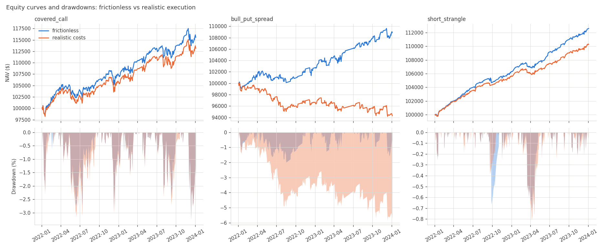
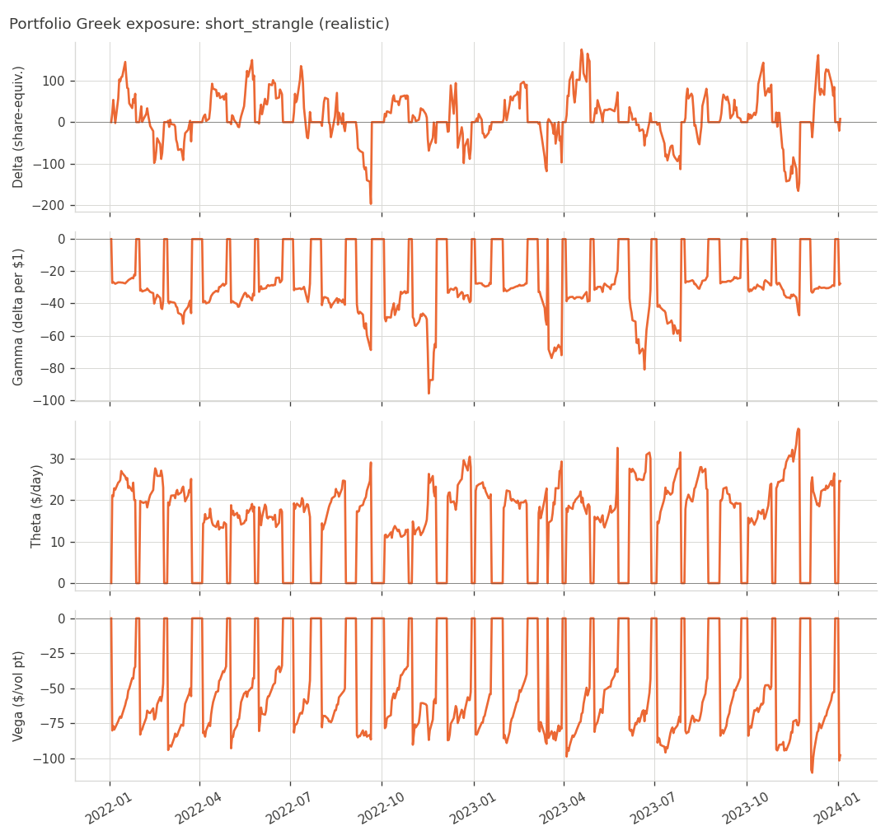

# optbt — an options-strategy backtesting engine

A modular Python engine for backtesting options strategies on a **simulated market** with **realistic execution costs**. It prices a full synthetic option chain every day with Black-Scholes on top of a simulated underlying (GBM or Heston stochastic volatility), fills orders at the bid/ask plus liquidity-dependent slippage and commissions, settles expiries by moneyness (cash or physical), and reports risk-adjusted performance together with the portfolio's Greek exposure over time.

The headline experiment shipped with the repo runs three strategies with and without execution costs on the *same* simulated path:

| Strategy | P&L frictionless | P&L realistic | Explicit costs | Sharpe (f → r) | Win rate (f → r) |
|---|---:|---:|---:|---:|---:|
| Covered call (5 lots) | 15,565 | 13,164 | 1,597 | 0.63 → 0.42 | 85% → 83% |
| Bull put spread (10x) | 8,862 | **-5,710** | 15,912 | 0.05 → -2.38 | 68% → 43% |
| Short strangle (5x) | 12,612 | 10,287 | 2,753 | 1.53 → 0.67 | 85% → 68% |

*Heston market, seed 42, 2022-01-03 to 2024-01-03, $100k starting capital. Numbers are illustrative of a single simulated path, not a forecast.* The point of the table is the last two columns: a strategy that looks fine at mid-price can be a net loser once you pay half the spread on every leg, and the damage scales with how many cheap, wide-spread contracts you trade. The 10-lot put spread crosses 2,260 contracts in two years and gives back 16% of starting capital in friction.



---

## Contents

1. [Quick start](#quick-start)
2. [Architecture](#architecture)
3. [Data approach: why simulate?](#data-approach-why-simulate)
4. [Execution model](#execution-model)
5. [Expiry settlement](#expiry-settlement)
6. [Performance and risk analytics](#performance-and-risk-analytics)
7. [Writing a strategy](#writing-a-strategy)
8. [Design decisions and limitations](#design-decisions-and-limitations)
9. [Tests](#tests)
10. [Project layout](#project-layout)

---

## Quick start

Requires Python 3.10+.

```bash
pip install -r requirements.txt
```

Run the frictionless-vs-realistic comparison (about 20 s for two years of daily data):

```bash
python examples/run_comparison.py
```

Options: `--model gbm|heston`, `--seed N`, `--years N`, `--start YYYY-MM-DD`, `--cash N`, `--out DIR`, `--no-plots`. The script writes `output/report.md`, per-strategy CSVs (equity curve, fills, trades, settlement events) and PNG charts (equity/drawdown comparison, market path, Greek exposure).

Run the tests:

```bash
python -m pytest
```

Use the engine from Python:

```python
from datetime import date
from optbt import Backtester, BacktestConfig, ExecutionConfig, MarketConfig
from optbt.strategy import ShortStrangle

market = MarketConfig(model="heston", start=date(2022, 1, 3), end=date(2023, 12, 29), seed=1)
execution = ExecutionConfig(initial_cash=100_000, settlement="cash", frictionless=False)

result = Backtester(ShortStrangle(contracts=5), BacktestConfig(market, execution)).run()
print(result.metrics["sharpe"], result.metrics["max_drawdown"], result.cost_summary)
result.equity[["nav", "delta", "vega"]].plot()
```

---

## Architecture

Seven layers with strictly one-way dependencies (each imports only from the layers above it):

```
pricing      Black-Scholes price, Greeks, implied-vol inversion            (pure functions)
instruments  OptionContract, Stock, Quote, Position                       (data classes)
market       PriceSimulator (GBM / Heston) -> VolSurface -> ChainBuilder   (data generation)
execution    SpreadModel, SlippageModel, CommissionModel, SimulatedBroker (fills, accounting, settlement)
strategy     Strategy interface, Context, three example strategies
engine       Backtester: the daily event loop; BacktestResult
analytics    compute_metrics (Sharpe, Sortino, drawdown, win rate ...), greek_exposure_summary
reporting    Markdown report builder, matplotlib charts
```

The daily loop in `optbt/engine.py`:

```
for each trading day t:
    chain   = builder.build(t, date, spot[t])       # price every listed contract at today's IV
    orders  = strategy.on_bar(ctx)                  # ctx: chain, positions, Greeks, NAV
    for o in orders: broker.execute(o, chain)       # bid/ask + slippage + commission
    events  = broker.settle_expirations(chain)      # contracts expiring today, by moneyness
    record(nav, cash, spot, atm_iv, delta, gamma, theta, vega, ...)
```

Two things make the "with vs without costs" comparison clean:

* The random generator is seeded from `MarketConfig.seed` and consumed only by the market layer, so the path and surface are bit-identical across execution settings.
* The `ChainBuilder` receives the half-spread function by injection. The market layer never imports the execution layer; a frictionless run simply injects a zero-spread function.

---

## Data approach: why simulate?

Historical option chains with bid/ask are expensive and, for free sources, patchy and survivorship-biased. Instead the engine builds its own market and is explicit about the model:

1. **Underlying path.** Daily steps (`dt = 1/252`) from either
   * geometric Brownian motion (`mu`, `sigma`), or
   * **Heston** stochastic volatility with a full-truncation Euler scheme: `dS/S = mu dt + sqrt(v) dW_s`, `dv = kappa(theta - v) dt + xi sqrt(v) dW_v`, `corr = rho`. With `rho < 0` the path has the leverage effect: vol rises when spot falls. Defaults satisfy the Feller condition (`2*kappa*theta > xi^2`).

2. **Implied-vol surface.** Implied vol is deliberately *not* the realised vol of the path. A `VolSurface` answers `iv(t, spot, strike, tte)` as `ATM(t, tte) + skew*m + smile*m^2`, where `m = ln(K/S) / (ATM*sqrt(T))` is standardised moneyness. Negative `skew` makes puts richer than calls, as in equity markets. The ATM term-structure level comes from:
   * `HestonImpliedVol` (default with the Heston path): `sqrt(expected average variance to expiry) * (1 + iv_premium)`. Expected average variance under Heston is `theta + (v_t - theta)(1 - e^{-kappa T})/(kappa T)`, so the surface has a natural term structure that inverts when spot vol spikes, and a volatility-risk premium over what the path will realise.
   * `SeriesVol` (default with GBM): a mean-reverting log-IV process correlated with the spot shocks, plus a linear term-structure slope.
   * `ConstantVol`: fixed level, for tests and controlled experiments.

3. **Option chain.** Each day the builder lists strikes on a "nice" grid around spot (step ≈ 2.5% of spot, 15 strikes each side) for the next three monthly (third-Friday) expiries, and prices every contract with Black-Scholes at the surface vol. Contracts that are held but have drifted off the grid are priced on demand, so positions are always markable.

What this buys you: a fully consistent, arbitrage-free-by-construction chain with Greeks every day, tunable regimes (crash, vol spike, calm), and unlimited seeds for Monte-Carlo-style robustness checks. What it costs you: the strategies are only as realistic as the model. Black-Scholes at a skewed IV surface reproduces the *price* of the skew but not jumps, earnings gaps, pin risk at expiry, or the way real skew steepens in a sell-off beyond what Heston's `rho` produces. See [limitations](#design-decisions-and-limitations).

---

## Execution model

Fills are never at mid. `optbt/execution/costs.py` has three pluggable models, all configured from `ExecutionConfig`:

**Bid-ask spread** (`SpreadModel`). Full spread in $/share is

```
spread = max(min_abs,  (base_rel + otm_rel * (1 - x)) * extrinsic  +  intrinsic_rel * intrinsic)
x = 2 * min(|delta|, 1 - |delta|)      # 1 at the money, 0 deep ITM/OTM
```

with defaults `min_abs = $0.05`, `base_rel = 3%`, `otm_rel = 15%`, `intrinsic_rel = 0.5%`. This reproduces the three stylised facts that matter for option strategies: ATM contracts have the tightest relative spread; far-OTM contracts are cheap so the tick floor makes their relative spread huge (a $0.05 spread on a $0.15 option is 33%); deep-ITM contracts have wide absolute but narrow relative spreads. Stock trades pay 1 bp. The bid is floored at zero.

**Slippage** (`SlippageModel`). Concession beyond the touch, in half-spreads:

```
slippage = min( half_spread * impact * sqrt( qty / (depth * liquidity) ),  max_multiple * half_spread )
```

`liquidity` is a depth score in (0, 1] computed in the chain: 1 for ATM front-month, decaying with `x` and with days-to-expiry beyond 45. Ten contracts of a 10-delta back-month put cost far more to fill than ten ATM front-month contracts.

**Commission** (`CommissionModel`). $0.65 per contract by default, optional per-order, per-share and exercise fees.

Every `Fill` records `spread_cost`, `slippage_cost` and `commission` separately so the report can decompose friction. `ExecutionConfig(frictionless=True)` zeroes all three.

**Marking.** NAV marks positions at the theoretical mid. The cost of crossing the spread is therefore booked at trade time and never appears as a phantom loss on untraded positions. Cash accrues the risk-free rate (`cash_interest=True`), so an idle $100k earns 4% and Sharpe, which subtracts the same rate, measures what the options overlay adds.

---

## Expiry settlement

On a contract's expiry date, after the strategy has had its chance to act, `SimulatedBroker.settle_expirations` closes every open position in it against the closing spot:

* `intrinsic <= exercise_threshold` ($0.01 by default): **expires worthless**, closed at 0.00.
* otherwise: closed at intrinsic value. In **cash** mode that is the whole story. In **physical** mode the broker additionally books the share transfer: long call → +100 shares per contract, short call (assigned) → -100, long put → -100, short put (assigned) → +100. The transfer is implemented as an internal stock fill at spot with no costs, which is economically identical to exercising at the strike: receiving `S - K` in cash and buying shares at `S` leaves you long shares having paid `K`. The test `test_physical_equals_cash_plus_stock_trade` pins this equivalence.

Each settlement produces a `SettlementEvent` (`expired` / `exercised` / `assigned`, with `shares_delta`) that is stored on the result and passed to `Strategy.on_settlement`. The example covered call uses physical settlement, so an ITM call gets the shares called away and the strategy re-buys them the next day; the spread and strangle use cash settlement as index options would.

---

## Performance and risk analytics

`result.metrics` (from `optbt/analytics/metrics.py`):

| Metric | Definition |
|---|---|
| `total_return`, `cagr` | on the NAV series, 252 periods/year |
| `ann_volatility` | stdev of daily NAV returns × √252 |
| `sharpe` | mean(daily return − r/252) / stdev × √252 |
| `sortino` | same numerator over the RMS of negative excess returns (target 0) |
| `max_drawdown`, `max_drawdown_days` | worst peak-to-trough NAV decline and longest underwater stretch |
| `calmar` | CAGR / \|max drawdown\| |
| `n_trades`, `win_rate`, `avg_win`, `avg_loss`, `profit_factor`, `expectancy` | over **closed trades grouped by strategy tag**, so a two-leg spread is one trade; share lifecycles count individually; positions still open at the end are excluded |

**Greek exposure.** Every day the engine records the aggregate portfolio Greeks: `delta` (share-equivalents; long stock counts 1 per share), `delta_dollars`, `gamma` (delta change per $1), `theta` ($ per calendar day, positive = collecting) and `vega` ($ per vol point). `result.greek_summary` gives mean / min / max / % of days short vega and short gamma, and `plot_greeks` draws the four series:



You can see the strangle's delta swing toward ±150 shares as spot approaches a strike, gamma become most negative right before each roll, and vega reset each time a new month is sold.

---

## Writing a strategy

Subclass `Strategy`, implement `on_bar`, return market orders. The `Context` gives you today's chain, your positions and portfolio Greeks; you never touch the broker's accounting.

```python
from optbt.execution.orders import Order, Side
from optbt.pricing import OptionType
from optbt.strategy import Strategy

class ProtectivePut(Strategy):
    name = "protective_put"

    def on_bar(self, ctx):
        orders = []
        if ctx.stock_quantity() < 100:
            orders.append(Order(ctx.stock, Side.BUY, 100 - ctx.stock_quantity(), tag=f"{self.name}#shares"))
        if not ctx.option_positions():
            q = ctx.chain.find(OptionType.PUT, target_delta=0.25, min_dte=45, max_dte=75)
            if q is not None:
                orders.append(Order(q.contract, Side.BUY, 1, tag=self.next_tag()))
        return orders
```

Useful pieces of the API:

* `chain.find(kind, target_delta=..., min_dte=..., max_dte=...)` picks the earliest listed expiry in the DTE window and the strike nearest the target |delta|; pass `strike=` instead of a delta, or `expiry=` to pin an expiry (e.g. for the second leg of a spread).
* `chain.quote(contract)` prices any contract, listed or not; quotes carry `bid`, `ask`, `mid`, `iv`, `delta/gamma/theta/vega`, `liquidity`, `dte`.
* `ctx.option_positions()` / `ctx.positions()` return `Position` objects with `quantity` (signed), `avg_price`, `tag`; `ctx.close_order(pos)` builds the flattening order.
* Give both legs of a multi-leg trade the same `tag` (from `self.next_tag()`) so analytics count them as one trade.
* Optional hooks: `on_start(ctx)`, `on_settlement(ctx, events)`.

The three bundled strategies (`optbt/strategy/`) show the patterns: `CoveredCall` (physical assignment, take-profit roll), `BullPutSpread` (two-leg entry, profit target and stop on the cost to close, lone-leg cleanup after settlement) and `ShortStrangle` (time-based management at 21 DTE).

---

## Design decisions and limitations

**Decisions**

* **Daily bars, act/365.** Time to expiry for pricing is calendar days / 365; simulation steps are trading days at 1/252. Expiry-day contracts are priced at intrinsic (`T = 0`), and strategies see them with `dte == 0` before settlement runs.
* **European pricing for everything.** American early exercise is ignored. For non-dividend-paying underlyings this only matters for deep-ITM puts, and the settlement logic exercises at expiry only.
* **Trading calendar.** Monday–Friday; exchange holidays are ignored. Expiries are third Fridays.
* **Own normal CDF.** `math.erf` instead of SciPy: a chain of ~180 contracts is priced every day and scalar `math` calls are about 10× faster than `scipy.stats.norm.cdf` on scalars. SciPy is not a dependency.
* **Strategies are stateless where possible.** They re-derive what they hold from positions each day, which makes them robust to positions vanishing through settlement.
* **No margin model.** Cash can go negative (assignment, debit trades); it is charged the risk-free rate but there are no buying-power checks. Short-premium sizing is your responsibility.
* **Fill at the close.** Orders generated on a bar fill on that bar's chain. There is no intraday path, so stops fill at the daily mark, not at the intraday extreme.

**Known limitations of the market model**

* Black-Scholes at a parametric surface has no jumps, no earnings, and no event risk; tail losses on short-premium strategies will be understated relative to real markets.
* Skew is a static function of standardised moneyness. Real skew steepens in sell-offs beyond what `rho` in Heston induces, and the smile is not calibrated to any name.
* With daily Euler steps the Heston variance can still get close to zero for stretches even when Feller holds, producing periods of very low IV (6–10%). Raise `kappa` or `theta`, or lower `xi`, if you want a calmer surface.
* Liquidity is a stylised score, not order-book data. The spread and slippage parameters are chosen to look like a liquid single-name / ETF chain for retail size; scale them for illiquid names.
* One simulated path is one draw. For robustness, loop over seeds and look at the distribution of outcomes rather than any single equity curve.

---

## Tests

`python -m pytest` runs 101 tests in ~8 s:

* `test_black_scholes.py` — textbook reference values (Hull: S=K=100, T=1, r=5%, σ=20%), put–call parity across strikes/tenors/dividends, Greeks vs central finite differences, `T = 0` limits, implied-vol round trips and no-arbitrage rejection.
* `test_execution.py` — spread widens relative to price for OTM and cheap contracts, tick floor, ITM absolute vs relative spread; slippage grows with size and falls with liquidity and is capped; fills cross the spread and pay slippage/commission while frictionless fills are exactly at mid; average-cost accounting, realised P&L, position flips, stock fills, interest accrual.
* `test_settlement.py` — long call exercised (shares in, cash out at the strike), short call/put assigned, cash vs physical, worthless expiry keeps the premium, exercise threshold, non-expiring contracts untouched, and physical ≡ cash + stock trade.
* `test_market.py` — calendar/expiries, GBM reproducibility and realised-vol scale, Heston variance non-negativity and mean reversion, OU IV reversion, skew ordering, Heston term structure, strike grid, liquidity score, chain `find` by delta/strike/expiry, on-demand quoting.
* `test_metrics.py` — drawdown and duration, Sharpe/Sortino against hand computation, tag-grouped trade stats.
* `test_engine.py` — end-to-end runs of all three strategies, NAV = cash + positions identity, identical market across cost settings, realistic fills strictly off-mid on the right side, short-premium Greeks have the expected signs, covered-call delta bounded by the share count, settlement events recorded, interest accrual.

---

## Project layout

```
options-backtester/
├── optbt/
│   ├── config.py                MarketConfig, ExecutionConfig, BacktestConfig
│   ├── instruments.py           Stock, OptionContract, Quote, Position
│   ├── engine.py                Backtester, BacktestResult, build_market
│   ├── pricing/black_scholes.py price, Greeks, implied_vol
│   ├── market/
│   │   ├── calendar.py          trading days, third-Friday expiries
│   │   ├── simulation.py        GBMSimulator, HestonSimulator
│   │   ├── vol_surface.py       ConstantVol, SeriesVol, HestonImpliedVol, OU log-IV process
│   │   └── chain.py             ChainBuilder, OptionChain, liquidity score
│   ├── execution/
│   │   ├── costs.py             SpreadModel, SlippageModel, CommissionModel, ExecutionCosts
│   │   ├── orders.py            Order, Side, Fill
│   │   └── broker.py            SimulatedBroker (fills, accounting, settlement, Greeks)
│   ├── strategy/
│   │   ├── base.py              Strategy, Context
│   │   ├── covered_call.py
│   │   ├── vertical_spread.py   BullPutSpread
│   │   └── strangle.py          ShortStrangle
│   ├── analytics/
│   │   ├── metrics.py           compute_metrics, drawdown_series, trade_groups
│   │   └── greeks.py            greek_exposure_summary
│   └── reporting/
│       ├── report.py            Markdown tables and the full report
│       └── plots.py             equity/drawdown, market, Greek charts
├── examples/run_comparison.py   frictionless vs realistic, three strategies
├── tests/                       101 unit and integration tests
├── pyproject.toml
└── requirements.txt
```
